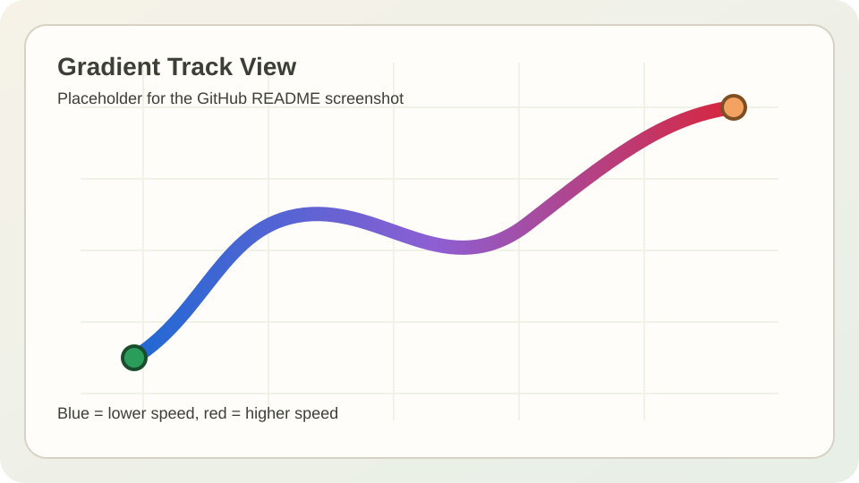
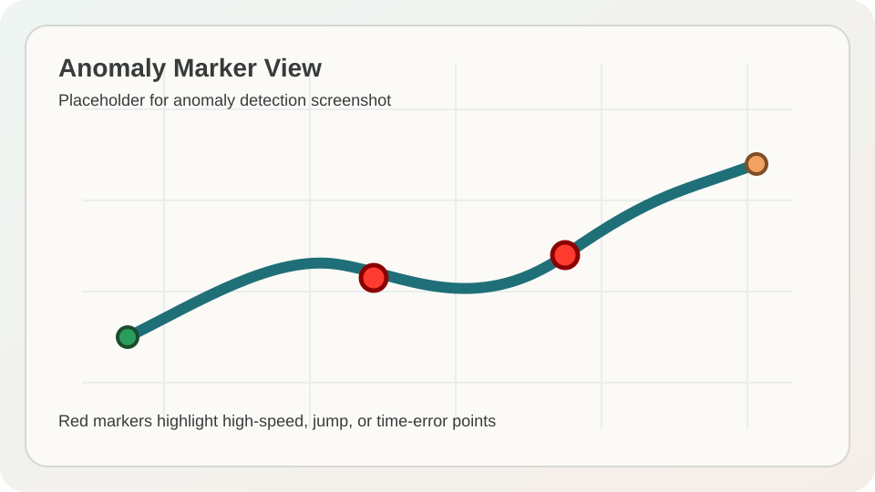

# nmea-track-tool

`nmea-track-tool` is a small Python project for converting, analyzing, cleaning, and visualizing NMEA 0183 GPS tracks.

It includes a one-time `UMT -> NMEA` converter, a reusable processing core, a command-line analyzer, and a PySide6 desktop viewer for interactive track inspection.

## Key Features

- UMT to NMEA conversion with checksum generation and simple CLI options
- reusable core pipeline for parsing, validation, segmentation, metrics, anomaly detection, and smoothing
- command-line track analysis with CSV and JSON export
- desktop viewer with summary panel, editable point table, and interactive map
- automatic anomaly detection for `high_speed`, `jump`, and `time_error`
- optional moving-average smoothing for GPS jitter reduction
- map visualization with raw or smoothed geometry and optional speed-based color gradient
- edit workflow with delete, anomaly removal, reset, undo, and redo

## Feature Overview

### Anomaly Detection

The viewer can mark suspicious GPS samples using simple rule-based checks:

- `high_speed`
- `jump`
- `time_error`

Detected anomaly points are highlighted in the table and shown as red markers on the map.

### Smoothing

The project supports a simple moving-average smoother for latitude and longitude only.

- raw coordinates are preserved
- smoothed coordinates are stored separately
- the GUI can switch between raw and smoothed views

### Visualization

The map view supports:

- track polylines
- start and end markers
- anomaly markers
- optional color-by-speed rendering from blue to red

## Project Layout

- `tools/umt_to_nmea/`
  one-time UMT -> NMEA converter
- `core/`
  reusable parsing, validation, segmentation, metrics, anomaly, smoothing, and pipeline logic
- `cli/`
  command-line analyzer
- `gui/`
  PySide6 desktop viewer
- `sample_data/`
  demo NMEA and UMT files
- `docs/screenshots/`
  README screenshot placeholders

## Installation

Python 3.11 or newer is recommended.

### 1. Create a Virtual Environment

Windows:

```powershell
python -m venv .venv
.venv\Scripts\activate
```

macOS / Linux:

```bash
python -m venv .venv
source .venv/bin/activate
```

### 2. Install GUI Dependency

The core pipeline and CLI use the Python standard library.
The desktop viewer requires `PySide6`.

```bash
pip install PySide6
```

### 3. Run Tests

```bash
python -m unittest discover -s tests -t .
```

## Demo Data

The repository includes small demo tracks for quick exploration:

- `sample_data/clean_track.nmea`
  stable track with no deliberate anomalies
- `sample_data/anomaly_track.nmea`
  track with jump and timing issues to exercise anomaly detection
- `sample_data/noisy_track.nmea`
  track with visible GPS jitter for smoothing demos
- `sample_data/demo_track.nmea`
  original small demo file used by earlier examples
- `sample_data/xidantot3.umt`
  raw UMT input for the converter

## CLI Usage

Analyze a clean demo track:

```bash
python -m cli.nmea_track_cli analyze sample_data/clean_track.nmea
```

Analyze an anomaly-heavy track and export structured output:

```bash
python -m cli.nmea_track_cli analyze sample_data/anomaly_track.nmea --export-points-csv output/anomaly_points.csv --export-summary-json output/anomaly_summary.json
```

Convert a UMT file to NMEA:

```bash
python tools/umt_to_nmea/umt_to_nmea.py sample_data/xidantot3.umt -o output/converted_track.nmea
```

Convert a UMT file with an explicit UTC start datetime:

```bash
python tools/umt_to_nmea/umt_to_nmea.py sample_data/xidantot3.umt -o output/converted_track.nmea --start-datetime 2026-03-12T00:00:00Z
```

Convert only a time window:

```bash
python tools/umt_to_nmea/umt_to_nmea.py sample_data/xidantot3.umt -o output/converted_track_window.nmea --time-start 10 --time-end 120
```

## GUI Usage

Start the desktop viewer:

```bash
python -m gui.app
```

Suggested demo flow:

1. Open `sample_data/noisy_track.nmea`.
2. Click `Apply Smoothing`.
3. Enable `Show Smoothed View`.
4. Enable `Color by Speed`.
5. Switch to `sample_data/anomaly_track.nmea`.
6. Click `Detect Anomalies`.
7. Review the red anomaly markers on the map.
8. Optionally click `Remove All Anomalies`, then use `Undo` and `Redo`.

If Qt is not available in the current interpreter, running from the project virtual environment is the safest option:

```powershell
.venv\Scripts\python.exe -m gui.app
```

## Screenshots

### Gradient Track Placeholder



### Anomaly Marker Placeholder



## Example Commands

Quick CLI summary:

```bash
python -m cli.nmea_track_cli analyze sample_data/clean_track.nmea
```

Anomaly demo:

```bash
python -m cli.nmea_track_cli analyze sample_data/anomaly_track.nmea
```

GUI startup:

```bash
python -m gui.app
```

Full test suite:

```bash
python -m unittest discover -s tests -t .
```

## Notes

- The GUI uses the existing `core.pipeline` module and does not duplicate track parsing logic.
- Smoothing is optional and does not overwrite raw track data.
- Visualization options are meant to stay lightweight and responsive for small to medium demo tracks.
